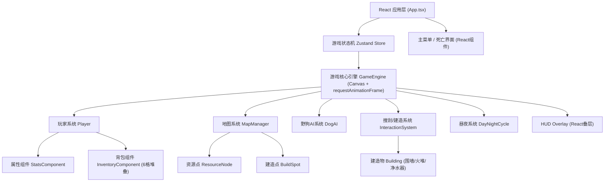

## 1. Architecture Design



## 2. Technology Description
- **Frontend**: React@18 + TypeScript + Vite + TailwindCSS@3 + Zustand
- **渲染引擎**: HTML5 Canvas 2D API (像素风无抗锯齿, imageSmoothingEnabled=false)
- **状态管理**: Zustand (全局游戏状态: 场景切换/存活天数/玩家属性)
- **初始化工具**: vite-init (react-ts模板)
- **后端**: 无，纯前端游戏，所有状态内存管理

## 3. Route Definitions
| Route | Purpose |
|-------|---------|
| / | 主入口，单页应用，根据gameState渲染主菜单/游戏/死亡界面 |

## 4. Data Model

### 4.1 Core Types
```typescript
// 坐标点
interface Vec2 { x: number; y: number; }

// 物品类型
type ItemType = 'wood' | 'can' | 'cloth';

// 资源点类型
type ResourceType = 'car' | 'store';

// 建造物类型
type BuildingType = 'wall' | 'campfire' | 'water_purifier';

// 背包槽位
interface InventorySlot {
  item: ItemType | null;
  count: number;
}

// 玩家状态
interface PlayerState {
  pos: Vec2;
  direction: 'up'|'down'|'left'|'right';
  hp: number;      // 0-100
  hunger: number;  // 0-100
  thirst: number;  // 0-100
  isRolling: boolean;
  rollCooldown: number;    // ms，0表示可用
  invincibleUntil: number; // 翻滚无敌截止时间戳
  inventory: InventorySlot[]; // 长度=6
  selectedSlot: number; // 0-5
}

// 资源点
interface ResourceNode {
  id: string;
  pos: Vec2;
  type: ResourceType;
  looted: boolean;
}

// 建造点
interface BuildSpot {
  id: string;
  pos: Vec2;
  building: BuildingType | null;
  campfireLit: boolean;     // 仅火堆用
  campfireFuelUntil: number; // 仅火堆用，燃料截止时间
}

// 野狗
interface WildDog {
  id: string;
  pos: Vec2;
  state: 'idle'|'chase'|'windup'|'attack'|'cooldown';
  stateUntil: number;
  hp: number;
}

// 昼夜
type DayPhase = 'day' | 'night';
interface DayNightState {
  phase: DayPhase;
  phaseEndTime: number; // 时间戳
  dayCount: number;
}

// 全局游戏状态
type GameScene = 'menu' | 'playing' | 'dead';
interface GameState {
  scene: GameScene;
  player: PlayerState;
  resources: ResourceNode[];
  buildSpots: BuildSpot[];
  dogs: WildDog[];
  dayNight: DayNightState;
  deathReason: string;
  // actions
  startGame: () => void;
  returnToMenu: () => void;
}
```

### 4.2 游戏常量
```
MAP_WIDTH = 1920; MAP_HEIGHT = 1280; // 逻辑地图大小(像素)
VIEW_W = 960; VIEW_H = 640;          // 视口/Canvas大小
TILE_SIZE = 64;
PLAYER_SPEED = 3;     // 像素/帧 @60fps
ROLL_SPEED = 12;      // 翻滚速度
ROLL_DURATION = 400;  // ms
ROLL_COOLDOWN = 2000; // ms
DOG_SNIFF_RANGE = 200;
DOG_WINDUP_TIME = 600; // ms 攻击前摇
DOG_DAMAGE = 10;
DAY_DURATION = 180;   // 秒
NIGHT_DURATION = 90;  // 秒
NIGHT_HP_DRAIN = 1;   // 每秒扣血(无火堆时)
CAMPFIRE_WARM_RANGE = 120;
CAMPFIRE_FUEL_PER_WOOD = 60; // 秒
HUNGER_DRAIN = 0.1;   // 每秒
THIRST_DRAIN = 0.15;  // 每秒
CAN_HUNGER_RESTORE = 30;
PURIFIER_THIRST_RESTORE = 30;
PURIFIER_RANGE = 80;
BUILD_COSTS = { wall: {wood:5}, campfire:{wood:3}, water_purifier:{wood:2,cloth:2} };
STACK_LIMIT = 99;
```

## 5. 核心系统职责划分

| 模块 | 关键函数 | 职责 |
|------|---------|------|
| GameEngine | run(), render(), update(dt) | 主循环，协调各子系统，相机跟随，Canvas渲染调度 |
| InputManager | isDown(key), justPressed(key) | 键盘输入缓冲，区分持续/瞬时按键 |
| Player | update(), roll(), useItem(slot) | 移动/翻滚/无敌/属性消耗/进食 |
| MapManager | refreshDailyResources(), getNearbyResource(pos,range) | 瓦片绘制、每日资源刷新、建造点渲染 |
| InteractionSystem | tryLoot(), tryBuild(), tryDrink() | 判定距离、消耗资源、播放反馈 |
| DogAI | updateAll() | 嗅探→追击→前摇→攻击→冷却状态机 |
| DayNightCycle | tick(now) | 昼夜切换、触发新一天资源刷新、夜晚扣血判定 |
| HUD | (React组件) | 属性条渲染、倒计时、背包栏、提示文本 |

## 6. 渲染顺序(z轴)
1. 地面瓦片(最底层)
2. 建造物(围墙/净水器/火堆底座)
3. 资源点(汽车/废墟)
4. 野狗
5. 玩家
6. 火堆火焰粒子(覆盖层)
7. 夜晚蒙层 & 视野 & 火堆光照(顶层混合)
8. HUD React叠层(DOM层，独立于Canvas)
