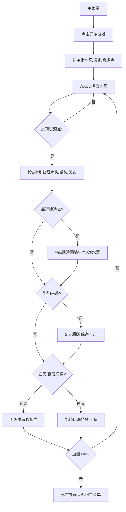

## 1. 产品概述
2D俯视像素风末日拾荒生存游戏。玩家在废墟世界中探索、搜刮资源、建造设施、对抗野狗，在昼夜循环中维持生存。
- 面向休闲生存游戏玩家，提供紧张刺激的资源管理和策略体验
- 核心玩法循环：探索→搜刮→建造→生存，具备高重玩性

## 2. 核心功能

### 2.1 Feature Module
1. **主菜单页面**：游戏标题、开始按钮、操作说明
2. **游戏主场景**：地图探索、玩家移动、资源搜刮、建造、战斗、昼夜循环
3. **HUD界面**：属性条、倒计时、背包显示、提示信息
4. **死亡结算界面**：死亡信息、返回主菜单

### 2.2 Page Details
| Page Name | Module Name | Feature description |
|-----------|-------------|---------------------|
| 主菜单 | 标题区 | 像素风末日游戏Logo，带闪烁效果 |
| 主菜单 | 操作说明 | WASD移动、E搜刮/建造、Shift翻滚的图文说明 |
| 主菜单 | 开始按钮 | 悬停缩放、点击进入游戏 |
| 游戏场景 | 地图系统 | 废墟瓦片地图，含3个固定建造点，每天随机刷3-5个资源点 |
| 游戏场景 | 玩家系统 | WASD移动(3px/帧)，Shift翻滚(12px/帧，0.4s无敌，2s冷却) |
| 游戏场景 | 属性系统 | 血量100、饥饿100、口渴100，每秒-0.1饥饿-0.15口渴 |
| 游戏场景 | 搜刮系统 | 靠近资源点(废弃汽车/便利店废墟)按E，随机获得木头/罐头/破布1-3个 |
| 游戏场景 | 背包系统 | 6格背包，同类物品堆叠上限99，显示图标+数量 |
| 游戏场景 | 建造系统 | 固定建造点按E：围墙(5木头)、火堆(3木头)、净水器(2木头+2破布) |
| 游戏场景 | 昼夜循环 | 白天180s，夜晚90s，夜晚无火堆附近每秒扣1血 |
| 游戏场景 | 野狗AI | 3只野狗，嗅探范围200px，攻击前摇0.6s，伤害10，可翻滚躲避 |
| 游戏场景 | 进食系统 | 按1-6键使用对应格物品：罐头+30饥饿，净水器附近按空格+30口渴 |
| HUD | 属性条 | 左上红(血量)/橙(饥饿)/蓝(口渴)三根渐变条 |
| HUD | 倒计时 | 右上显示白天/夜晚剩余秒数，昼夜图标区分 |
| HUD | 提示 | 资源点/建造点附近显示"按E..."浮动提示 |
| HUD | 背包栏 | 底部6格物品栏，数字键1-6高亮选中 |
| 死亡界面 | 结算 | "你没能挺过这一天"文字，存活天数统计，返回主菜单按钮 |

## 3. 核心 Process
玩家从主菜单进入游戏→在废墟地图中WASD探索→发现汽车/废墟按E搜刮获得资源→回固定建造点消耗资源建造围墙/火堆/净水器→白天结束进入夜晚，点燃火堆维持体温不扣血→野狗循味接近时Shift翻滚躲开前摇→血量归零→显示死亡界面→返回主菜单

## 4. User Interface Design

### 4.1 Design Style
- **主色调**：末日废土棕灰色系(#3d3529, #5c4a32, #8b7355)，血红(#c0392b)、火焰橙(#e67e22)、净水蓝(#3498db)作为强调色
- **像素风格**：所有图形采用Canvas绘制的8-bit像素块，无抗锯齿，整数坐标
- **字体**：像素字体"Press Start 2P"，等宽粗体
- **布局**：游戏Canvas居中(960x640)，HUD叠层定位，属性条左上，倒计时右上，物品栏底部
- **氛围**：夜晚使用深蓝色蒙层+视野渐变，火堆产生暖黄色光晕扩散

### 4.2 Page Design Overview
| Page Name | Module Name | UI Elements |
|-----------|-------------|-------------|
| 主菜单 | 整体 | 黑色背景+散落废墟像素图案，中央大标题"WASTELAND SCAVENGER"逐字显现动画，按钮灰底红边像素边框 |
| 游戏场景 | 地图 | 灰色瓦片地面(64x64px)，随机散落瓦砾像素点，资源点为2-3色像素绘制的汽车/便利店轮廓 |
| 游戏场景 | 玩家 | 16x24像素角色，绿色上衣+棕色裤子，面向方向根据移动键改变，翻滚时水平拉伸+透明度变化 |
| 游戏场景 | 野狗 | 12x16像素棕色犬形，攻击前摇时身体发红光抖动，移动轨迹留下淡褐色气味粒子 |
| 游戏场景 | 建造物 | 围墙=灰色堆叠像素块，火堆=跳动橙色像素火焰动画，净水器=蓝色箱体像素图 |
| HUD | 属性条 | 每根条48宽8高，带1px像素边框，数值百分比文字在条右侧 |
| HUD | 物品栏 | 每格48x48，像素边框，选中格高亮红边，物品图标居中+右下角白色数字数量 |
| 死亡界面 | 整体 | Canvas蒙层半透明黑，中央红色像素大字，统计数据小一号白色，按钮悬停红底白字 |

### 4.3 Responsiveness
- 桌面端为主，固定Canvas尺寸960x640
- 窗口小于Canvas时自动等比缩放，保持像素比例
- 不支持移动端触摸操作
